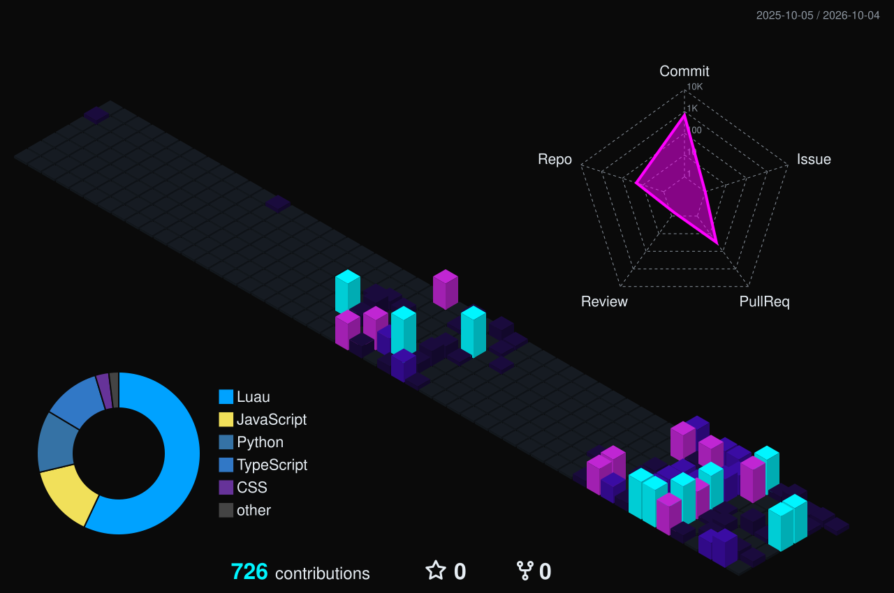

<!-- ============================================================ -->
<!--  MANIKARAJ ANBURAJ  //  GITHUB PROFILE                        -->
<!--  Theme: Cyberpunk Neon  |  cyan 00F5FF  magenta FF00FF        -->
<!--         yellow FFD700   |  green 39FF14  bg 0A0A0A            -->
<!--  Search for "TODO:" to find the placeholders you must fill.   -->
<!-- ============================================================ -->

<a name="top"></a>

<div align="center">




<br/>

<!-- Auto-refreshed daily by .github/workflows/statusbar.yml -->

<!-- invisible pixel keeps the komarev view counter live without showing the stock badge -->


<br/>

<!-- TODO: replace YOUR_PORTFOLIO_URL and YOUR_YOUTUBE_URL -->

<a href="https://www.linkedin.com/in/manikaraj-anburaj-4550ba354"></a>
<a href="mailto:manikraj8433@gmail.com"></a>
<a href="YOUR_PORTFOLIO_URL"></a>
<a href="YOUR_YOUTUBE_URL"></a>

</div>

<br/>


<br/>

<!-- ============================================================ -->
<!--  01 // PLAYER PROFILE                                         -->
<!-- ============================================================ -->

<a name="player-profile"></a>


## `01` PLAYER PROFILE

<table>
<tr>
<td width="55%" valign="top">

```text
manik@dev ~ $ whoami

███╗   ███╗ █████╗ ███╗   ██╗██╗██╗  ██╗
████╗ ████║██╔══██╗████╗  ██║██║██║ ██╔╝
██╔████╔██║███████║██╔██╗ ██║██║█████╔╝
██║╚██╔╝██║██╔══██║██║╚██╗██║██║██╔═██╗
██║ ╚═╝ ██║██║  ██║██║ ╚████║██║██║  ██╗
╚═╝     ╚═╝╚═╝  ╚═╝╚═╝  ╚═══╝╚═╝╚═╝  ╚═╝

NAME ........ Manikaraj Anburaj
CLASS ....... Game Developer / Full-Stack Engineer
GUILD ....... SIES Graduate School of Technology
DEGREE ...... B.E. Computer Engineering (TODO: '20XX)
LOCATION .... Navi Mumbai, Maharashtra, IN
ENGINES ..... Roblox Studio . Unity . Unreal Engine
STACK ....... MERN . TypeScript . Python . Luau . C# . C++
TITLES ...... 2x Hackathon Winner . Content Creator
UPTIME ...... since 2024-05 on GitHub
STATUS ...... [ ONLINE ]  building 67 Nights in the Forest
```

</td>
<td width="45%" valign="top">

```text
ATTRIBUTES                         LVL
──────────────────────────────────────
Gameplay Systems    ▰▰▰▰▰▰▰▰▰▱    90
Luau / Roblox       ▰▰▰▰▰▰▰▰▰▱    90
React / TypeScript  ▰▰▰▰▰▰▰▰▱▱    85
Node / Express      ▰▰▰▰▰▰▰▰▱▱    85
Unity / C#          ▰▰▰▰▰▰▰▱▱▱    75
Python / ML         ▰▰▰▰▰▰▰▱▱▱    70
Unreal / C++        ▰▰▰▰▰▰▱▱▱▱    60
3D / Blender        ▰▰▰▰▰▱▱▱▱▱    55

PASSIVES
──────────────────────────────────────
> Server-authoritative networking
> Procedural animation and VFX
> Rapid 24-48h hackathon prototyping
> Full product ownership: UI to DB
```

</td>
</tr>
</table>

> I design and ship interactive systems. On the game side that means multiplayer survival loops, combat, NPC AI and data persistence in Roblox (Luau), with Unity (C#) and Unreal Engine (C++) as my second and third engines. On the web side it means production-grade MERN and TypeScript stacks, often with a Python ML service behind them. I like problems where the hard part is making many moving pieces feel like one coherent experience.

<br/>

<!-- ============================================================ -->
<!--  02 // ARSENAL                                                -->
<!-- ============================================================ -->

<a name="arsenal"></a>


## `02` ARSENAL

<div align="center">


<a href="https://skillicons.dev"></a>


<br/><br/>


<a href="https://skillicons.dev"></a>

<br/><br/>


<a href="https://skillicons.dev"></a>


<br/><br/>


<a href="https://skillicons.dev"></a>


<br/><br/>


<a href="https://skillicons.dev"></a>


<br/><br/>


<a href="https://skillicons.dev"></a>

</div>

<br/>

<!-- ============================================================ -->
<!--  03 // FEATURED QUESTS                                        -->
<!-- ============================================================ -->

<a name="featured-quests"></a>


## `03` FEATURED QUESTS

<table>
<tr>
<td width="50%" valign="top">
<a href="https://github.com/manikkDev/67-nights-in-the-forest">

</a>

**Multiplayer survival game on Roblox** — endure 67 escalating nights in a hostile forest.

    

- Server-authoritative Knit services: data, world, spawn, time, combat, loot, rescue
- Session-locked DataStore persistence with ProfileService
- Day/night cycle, hunger and foraging loop, NPC enemies, cultist raids, procedural animation and VFX
- Landmark and cave loot systems, weapon tooling, rescue progression

</td>
<td width="50%" valign="top">
<a href="https://github.com/manikkDev/Enigma_CyberPookies">

</a>

**Arth Saathi** — privacy-preserving financial-risk platform for citizens and bank analysts.

     

- Six-service Docker Compose stack with health checks and non-root containers
- Horizontal federated learning (FedAvg / FedProx / FedAdam) across five bank partitions, 5.7M training rows
- Differential privacy via Opacus RDP accounting, simulated secure aggregation
- Neo4j fraud-ring detection with Louvain communities, DPDP-style consent center, audit trail

</td>
</tr>
<tr>
<td width="50%" valign="top">
<a href="https://github.com/manikkDev/portfolio-web-frontend">

</a>

**Gamified portfolio** — a cyberpunk HUD built as a product, not a template.

   

- Terminal hero, XP bars, crosshair cursor, scan-line and circuit backgrounds
- Lazy-loaded sections, code splitting, `prefers-reduced-motion` support
- Backend-connected contact, ratings, YouTube cache and LinkedIn feed
- Companion API: [portfolio-web-backend](https://github.com/manikkDev/portfolio-web-backend)

</td>
<td width="50%" valign="top">
<a href="https://github.com/manikkDev/neurofy-frontend">

</a>

**Neurofy** — tremor-monitoring platform with patient and doctor dashboards.

   

- Role-based routing for patients and clinicians
- Feature-module architecture with React Query and socket client
- Companion API: [neurofy-backend](https://github.com/manikkDev/neurofy-backend)

</td>
</tr>
</table>

<details>
<summary><b>Open the full quest log (more projects)</b></summary>
<br/>

| Project                 | Domain                                                                                                            | Stack                                  | Links                                                                                                                                                                                          |
| :---------------------- | :---------------------------------------------------------------------------------------------------------------- | :------------------------------------- | :--------------------------------------------------------------------------------------------------------------------------------------------------------------------------------------------- |
| **Aarogya Nigrani**     | Health monitoring dashboard with ML service                                                                       | TypeScript, Node, Python               | [frontend](https://github.com/manikkDev/aarogya-nigrani-frontend) · [backend](https://github.com/manikkDev/aarogya-nigrani-backend) · [ml](https://github.com/manikkDev/aarogya-nigrani-ai-ml) |
| **Juris AI**            | Judicial AI navigator                                                                                             | React, TS, shadcn/ui, Firebase, Python | [frontend](https://github.com/manikkDev/juris-ai-frontend) · [backend](https://github.com/manikkDev/juris-ai-backend) · [ml](https://github.com/manikkDev/juris-ai-ml)                         |
| **LegalAssist**         | LLM-powered legal assistant for rural India: document analysis, regional-language voice guidance, scam prevention | JavaScript, LLM                        | [repo](https://github.com/manikkDev/LegalAssist)                                                                                                                                               |
| **Luna AML**            | Anti-money-laundering analytics                                                                                   | JavaScript, Python                     | [app](https://github.com/manikkDev/luna-aml)                                                                                                                                                   |
| **Hear With Heart**     | Accessibility-focused web platform                                                                                | JavaScript, Node                       | [frontend](https://github.com/manikkDev/hear-with-heart-frontend) · [backend](https://github.com/manikkDev/hear-with-heart-backend)                                                            |
| **Urban Mobility**      | Smart city mobility platform                                                                                      | JavaScript, Node                       | [frontend](https://github.com/manikkDev/urban-mobility-frontend) · [backend](https://github.com/manikkDev/urban-mobility-backend)                                                              |
| **HealthWell / WeCare** | Health assistant prototypes                                                                                       | MERN                                   | [HealthWell](https://github.com/manikkDev/HealthWell-Frontend) · [WeCare](https://github.com/manikkDev/WeCare-Frontend)                                                                        |
| **Context Decay**       | TypeScript experiment on context handling                                                                         | TypeScript                             | [repo](https://github.com/manikkDev/Context-Decay)                                                                                                                                             |
| **Jarvis Mini**         | Voice assistant                                                                                                   | Python                                 | [repo](https://github.com/manikkDev/Jarvis-Mini)                                                                                                                                               |
| **Unity Projects**      | Early game prototypes                                                                                             | Unity, C#                              | [repo](https://github.com/manikkDev/Unity-Projects)                                                                                                                                            |

</details>

<br/>

<!-- ============================================================ -->
<!--  04 // ACHIEVEMENTS                                           -->
<!-- ============================================================ -->

<a name="achievements"></a>


## `04` ACHIEVEMENTS

<!-- TODO: fill hackathon names, organizers, dates and project names -->

<table>
<tr>
<td align="center" width="25%">
<br/><br/>
<b>Hackathon Winner I</b><br/>
<sub>TODO: [HACKATHON_NAME] · [ORGANIZER]<br/>[MONTH YEAR] · Project: [PROJECT]</sub>
</td>
<td align="center" width="25%">
<br/><br/>
<b>Hackathon Winner II</b><br/>
<sub>TODO: [HACKATHON_NAME] · [ORGANIZER]<br/>[MONTH YEAR] · Project: [PROJECT]</sub>
</td>
<td align="center" width="25%">
<br/><br/>
<b>Full-Stack Shipper</b><br/>
<sub>10+ paired frontend / backend repos<br/>delivered end-to-end</sub>
</td>
<td align="center" width="25%">
<br/><br/>
<b>Forest Survivor</b><br/>
<sub>Ship 67 Nights in the Forest<br/>to public Roblox</sub>
</td>
</tr>
</table>

<br/>

<!-- ============================================================ -->
<!--  05 // TELEMETRY                                              -->
<!-- ============================================================ -->

<a name="telemetry"></a>


## `05` TELEMETRY

<div align="center">


<br/><br/>


<br/><br/>

<!-- Generated daily by .github/workflows/profile-3d.yml -->


<br/>

<!-- Generated daily by .github/workflows/snake.yml -->
<picture>
  <source media="(prefers-color-scheme: dark)" srcset="https://raw.githubusercontent.com/manikkDev/manikkDev/output/github-snake-dark.svg"/>
  <source media="(prefers-color-scheme: light)" srcset="https://raw.githubusercontent.com/manikkDev/manikkDev/output/github-snake.svg"/>
  
</picture>

</div>

<br/>

<!-- ============================================================ -->
<!--  06 // ROADMAP                                                -->
<!-- ============================================================ -->

<a name="roadmap"></a>


## `06` ROADMAP

| Status                                                                                             | Quest                                 | Notes                                                             |
| :------------------------------------------------------------------------------------------------- | :------------------------------------ | :---------------------------------------------------------------- |
|  | **67 Nights in the Forest** — Phase 4 | Base building, rescue chain, day multiplier, win/loss, permadeath |
|  | **Unreal Engine 5** deep-dive         | C++ gameplay framework, GAS, Niagara                              |
|  | **Content creation**                  | Dev-logs and breakdowns on YouTube <!-- TODO: link -->            |
|  | **RPG project**                       | Cross-engine prototype: Roblox first, Unreal port                 |
|  | **Open-source Roblox tooling**        | Reusable Knit service patterns and Rojo templates                 |

<br/>

<!-- ============================================================ -->
<!--  07 // CONTACT                                                -->
<!-- ============================================================ -->

<a name="contact"></a>


## `07` CONTACT

<div align="center">

**Open to game development roles, full-stack contracts, hackathon teams and collaborations.**

<br/>

<!-- TODO: replace YOUR_PORTFOLIO_URL and YOUR_YOUTUBE_URL -->

<a href="https://www.linkedin.com/in/manikaraj-anburaj-4550ba354"></a>
<a href="mailto:manikraj8433@gmail.com"></a>
<a href="YOUR_PORTFOLIO_URL"></a>
<a href="YOUR_YOUTUBE_URL"></a>

<br/><br/>

<a href="#top"></a>

<br/><br/>

```text
> press [START] to collaborate
```



</div>
